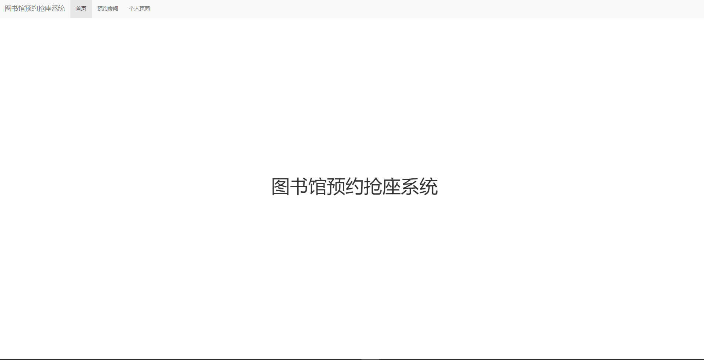
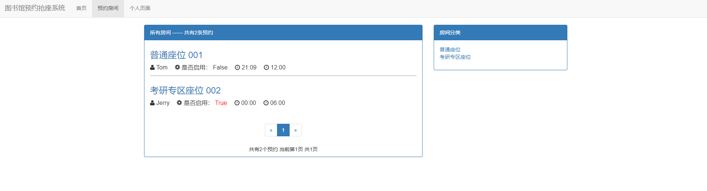
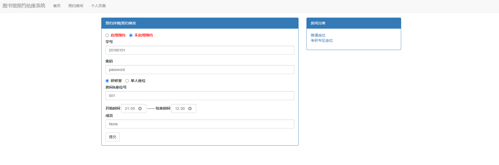

# 图书馆预约抢座系统

## 一、说明

**本程序只供学习交流娱乐之用,由此产生任何纠纷由使用者自己承担!**

## 二、更新记录

| 序号 |  更新日期  |               更新内容               | 系统是否完成 |
| :--: | :--------: | :----------------------------------: | :----------: |
|  01  | 2021.07.13 |           创建room应用模型           |    未完成    |
|  02  | 2021.07.14 |          创建路由和前端界面          |    未完成    |
|  03  | 2021.07.14 |       创建静态文件夹和前端模板       |    未完成    |
|  04  | 2021.07.14 | Bootstrap、CSS美化前端及创建分类界面 |    未完成    |
|  05  | 2021.07.15 |    预约房间列表分页及底部页码添加    |    未完成    |
|  06  | 2021.07.15 |      房间详情页面添加表单及美化      |    未完成    |
|  07  | 2021.07.15 |  添加网页图标及修改列表页面显示项目  |    未完成    |
|  08  | 2021.07.16 |            登录功能的实现            |    未完成    |
|  09  | 2021.07.16 |           登录功能bug修复            |    未完成    |
|  10  | 2021.07.16 |   修改vscode文件配置及登录成功跳转   |    未完成    |
|  11  | 2021.07.16 |            创建error页面             |    未完成    |
|  12  | 2021.07.16 |  创建个人页面及修改查看详情界面权限  |    已完成    |

## 三、使用方式

1. 打开命令行
2. 切换到“manage.py”的目录下
3. 执行命令“python3 manage.py runserver”

> 注：本程序库中数据库已保存了超级管理员和几个用户的用户名和密码
>
> 超级管理员：
>
> 用户名：admin	密码：12345678
>
> 普通用户：
>
> 用户一：Tom	密码：tsg12345678
>
> 用户二：Tom	密码：tsg12345678

## 四、运行展示

